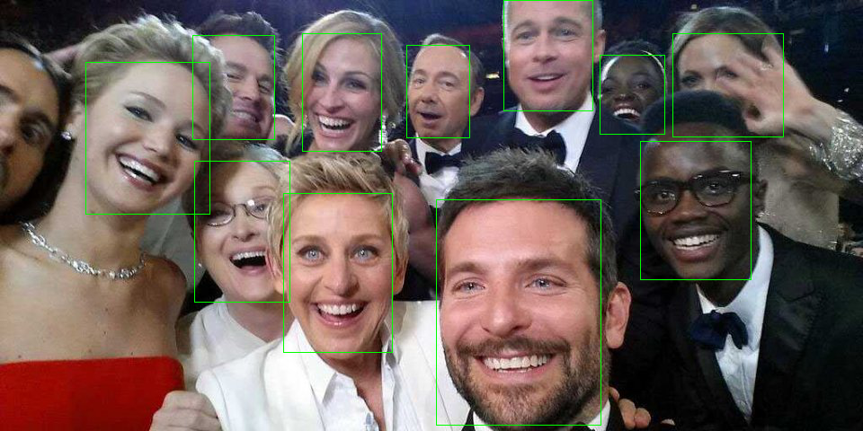

# SFD_pytorch
A PyTorch Implementation of Single Shot Scale-invariant Face Detector.

# Eval
```
python wider_eval_pytorch.py

cd eval/eval_tools_old-version
octave wider_eval_pytorch.m
```

# Test
```
python test.py --model data/s3fd_convert.pth --path data/test01.jpg
```


# References
[SFD](https://github.com/sfzhang15/SFD)